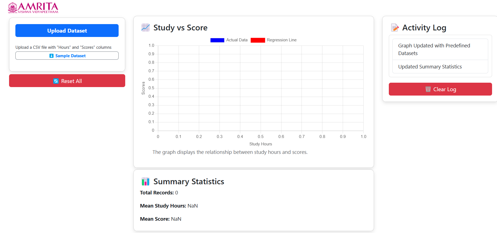
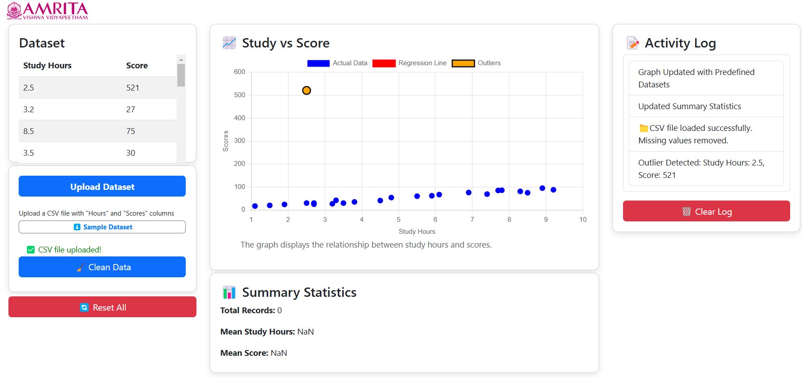
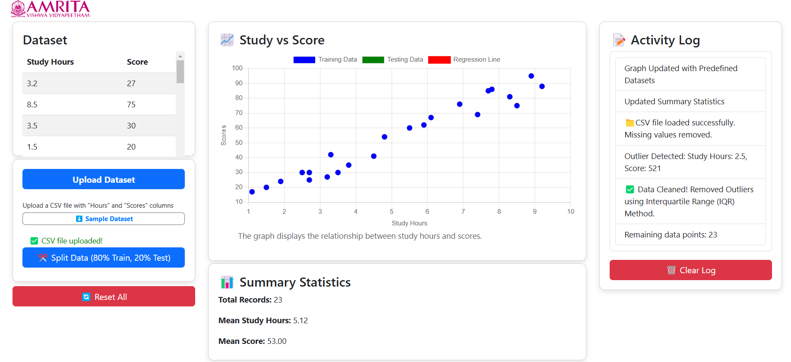
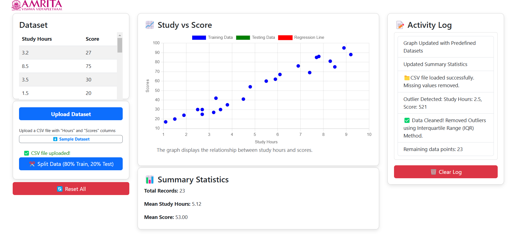
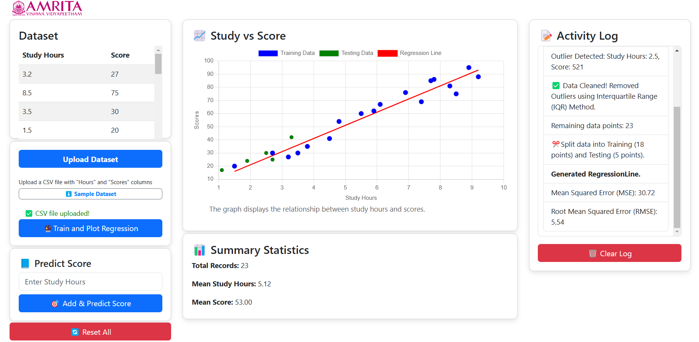
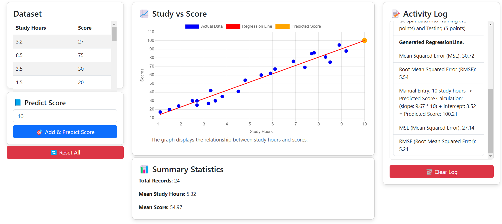

### Procedure

Step 1 : Click the "Upload" button to upload a CSV file containing "Hours" and "Scores" columns.

&nbsp;

Step 2: The uploaded datasets are displayed in the datasets table, and the study hours vs. scores graph highlights outlier detection.

&nbsp;

Step 3 : Click on the “Clean Data” button to clean the dataset by handling missing values and removing outliers .

&nbsp;

Step 4 : Click on the "Split Data" button to divide the uploaded dataset into training and testing points.

&nbsp;

Step 5 : Click on the "Train and Plot Regression" button to generate the regression line, which involves training the model on the dataset and plotting the line to visualize the relationship between study hours and scores.

&nbsp;

Step 6 : Enter the study hours and click on the “Add and Predict Score” button to predict the score.

&nbsp;
